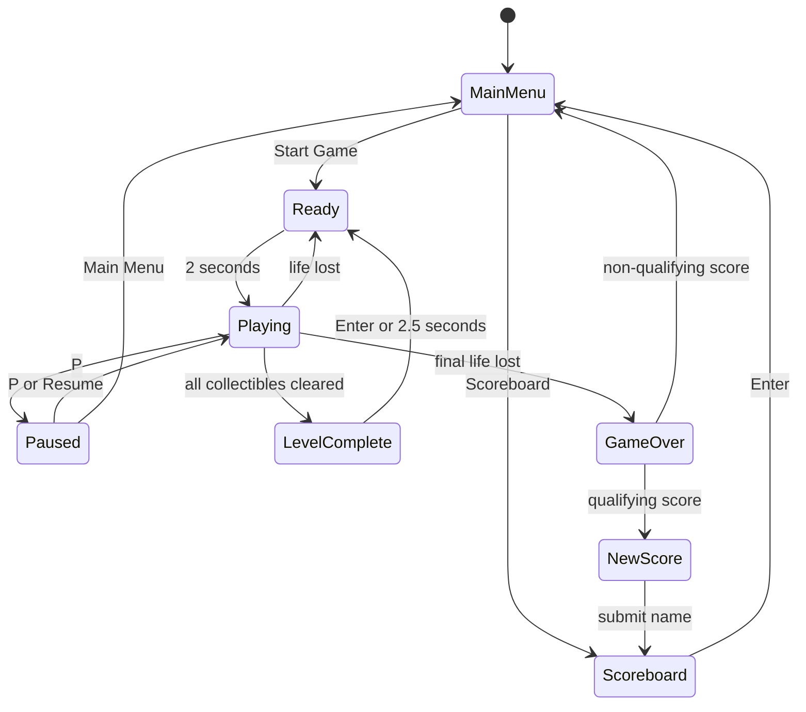
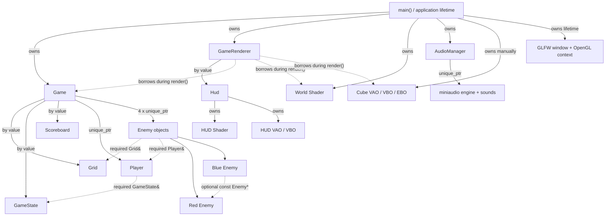
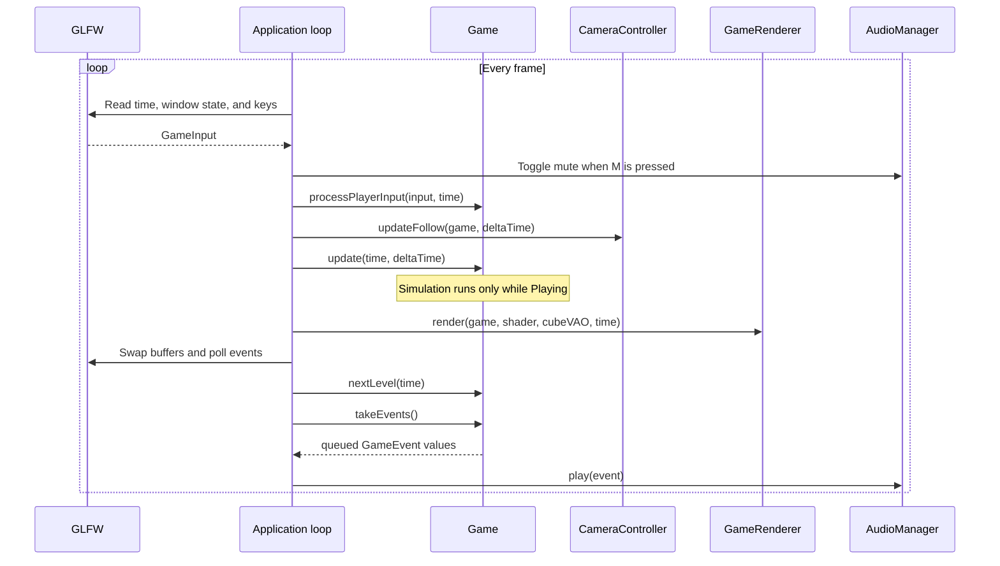
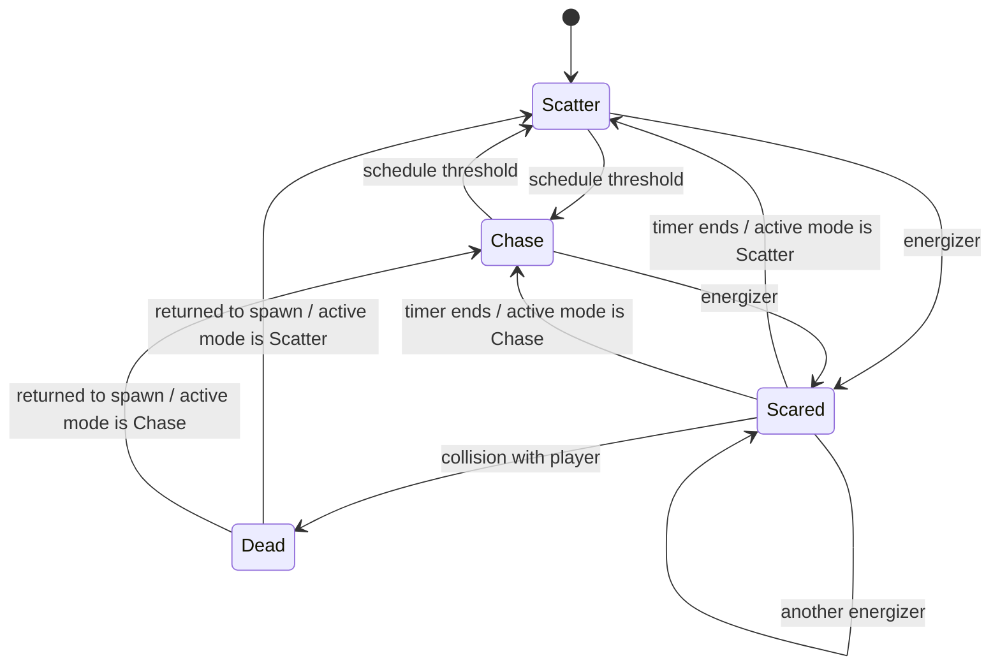

# PacBoy

[](https://github.com/ven0xO/PacBoy/actions/workflows/ci.yml)
[](https://en.cppreference.com/w/cpp/17)
[](https://www.khronos.org/opengl/)
[](LICENSE)

PacBoy is an educational 3D maze-chase game written in C++17 with OpenGL
3.3 Core. It combines grid-based gameplay with a procedural voxel-style
renderer, colour-specific ghost behaviour, a pixel HUD, local high scores,
sound effects, automated tests, and continuous integration.

The project is an unofficial fan project inspired by classic maze-chase games.
It is not affiliated with or endorsed by Bandai Namco Entertainment. The
repository does not grant rights to any third-party names or trademarks.

## Highlights

- Procedural 3D models built from a shared cube mesh, with directional
  lighting, emissive materials, additive glow, and neon wall outlines.
- Grid-based, frame-rate-independent player and ghost movement with tile-centre
  snapping, buffered turns, collision detection, and paired edge tunnels.
- Four ghosts with individual release delays, Scatter/Chase targets, a timed
  Scared state, escalating ghost-eaten scores, and a Dead return-to-spawn flow.
- Complete UI flow: main menu, Ready, pause menu, level completion, Game Over,
  arcade-style name entry, and a Top 10 scoreboard.
- Local JSON scoreboard that recovers safely from missing, empty, malformed, or
  incomplete data.
- Eight synthesized sound effects, event-driven audio playback, and global
  mute.
- Headless Catch2 tests for gameplay rules, map validation, score handling,
  movement, ghost behaviour, and the main gameplay flow.
- CMake presets, strict warnings, clang-format, clang-tidy, ASan/UBSan, and CI
  builds with both GCC and Clang.

## Gameplay

PacBoy starts with three lives. Clearing every pellet and energizer completes
the level. Score and remaining lives carry over between levels; losing a life
keeps already collected items and starts a new Ready phase.

| Action | Points |
|---|---:|
| Collect a pellet | 10 |
| Collect an energizer | 50 |
| Eat the first Scared ghost | 200 |
| Eat the second Scared ghost | 400 |
| Eat the third Scared ghost | 800 |
| Eat the fourth Scared ghost | 1600 |

Ghost-eaten scoring resets when a new energizer is collected.

The implemented screen flow is:



At present, the configured level list contains one map, so completing it reloads
the same map at the next level number.

## Requirements

PacBoy currently targets and is continuously tested on Linux. It requires:

- CMake 3.20 or newer;
- a C++17 compiler;
- OpenGL 3.3-capable hardware and drivers;
- GLFW 3;
- GLM;
- an internet connection during the first CMake configuration.

Ubuntu/Debian dependencies:

```bash
sudo apt-get update
sudo apt-get install --yes \
  build-essential \
  git \
  cmake \
  libgl1-mesa-dev \
  libglfw3-dev \
  libglm-dev
```

These dependencies are bundled or obtained by CMake:

| Dependency | Version | Source |
|---|---:|---|
| GLAD | 0.1.36-generated loader | Bundled in `external/GLAD` |
| nlohmann/json | 3.12.0 | CMake `FetchContent` |
| miniaudio | 0.11.25 | CMake `FetchContent` |
| Catch2 | 3.15.0 | Found locally or fetched when tests are enabled |

Windows and macOS have not been verified. The presets currently use Unix
Makefiles, and CI runs only on Ubuntu.

## Build and run

### Release

From the repository root:

```bash
cmake --preset release
cmake --build --preset release --parallel
cd build/release
./PacBoy
```

Run PacBoy from its build directory. The game loads shaders, levels, audio, and
scores using paths relative to the current working directory.

### Debug

```bash
cmake --preset debug
cmake --build --preset debug --parallel
cd build/debug
./PacBoy
```

### Tests

The gameplay test executable does not create a window or require an OpenGL
context:

```bash
cmake --preset test
cmake --build --preset test --parallel
ctest --preset test
```

### Static analysis

Install `clang-tidy`, then run:

```bash
cmake --preset tidy
cmake --build --preset tidy --parallel
```

### Sanitizers

The sanitizer preset enables AddressSanitizer and UndefinedBehaviorSanitizer
with GCC or Clang:

```bash
cmake --preset sanitizers
cmake --build --preset sanitizers --parallel
ctest --preset sanitizers
```

### Local installation

```bash
cmake --preset release
cmake --build --preset release --parallel
cmake --install build/release --prefix "$PWD/build/package"

cd build/package
./PacBoy
```

The install step copies the executable and its shaders, levels, and sound
effects. System OpenGL and GLFW libraries are still required.

## Controls

| Input | Action |
|---|---|
| Arrow keys | Move PacBoy or navigate a menu |
| Enter | Select, continue, or submit a score |
| `P` | Pause or resume gameplay |
| `M` | Toggle all audio |
| `Esc` | Exit |
| `A`–`Z` | Enter a scoreboard name |
| Backspace | Delete the last entered character |
| Mouse wheel | Zoom the camera |

During Ready, the arrow keys select the initial movement and camera direction
without moving PacBoy. Scoreboard names contain between 1 and 10 uppercase
letters. While entering a name, `M` is treated as a letter instead of toggling
audio.

## Level format

Levels are plain text files under `assets/levels`. Every character represents
one grid tile:

| Character | Meaning |
|---|---|
| `#` | Wall |
| `.` | Pellet |
| `*` | Energizer |
| `P` | PacBoy spawn |
| `r` | Red ghost spawn |
| `p` | Pink ghost spawn |
| `b` | Blue ghost spawn |
| `o` | Orange ghost spawn |
| `E` | Ghost-house exit |
| `S` | Ghost-house entrance/gate |
| `T` | Tunnel endpoint |
| space | Empty tile |

Minimal structural example:

```text
#######
#P..r##
#pSEbo#
#.*...#
#######
```

A valid level must satisfy all of the following:

- the file is not empty and contains only supported characters;
- there is exactly one `P` and exactly one of each `r`, `p`, `b`, and `o`;
- there is at least one `S`, and the numbers of `S` and `E` markers match;
- every `S` has exactly one orthogonally adjacent `E`, and every `E` has
  exactly one orthogonally adjacent `S`;
- every `T` is on one non-corner edge and has a matching `T` on the opposite
  edge in the same row or column.

Tunnel markers are optional. Multiple valid tunnel pairs and multiple `S`/`E`
pairs are supported. Short rows are padded on the right with empty tiles,
although rectangular maps are recommended.

Loading is transactional: the parser builds and validates temporary data, then
replaces the active grid only when the whole file is valid. A failed level load
therefore leaves the current valid grid intact. Positions outside the grid are
treated as walls except at validated tunnel endpoints.

## Scoreboard format

Local scores are stored in `assets/scores/scores.json`:

```json
{
    "scores": [
        {
            "name": "PLAYER",
            "score": 12500
        },
        {
            "name": "GHOST",
            "score": 8300
        }
    ]
}
```

Each entry requires a string `name` and an integer `score`. Entries are sorted
from highest to lowest and trimmed to ten records. When the table is full, a
new score must be strictly greater than the tenth-place score to qualify.

The directory and file are created automatically when missing. Invalid JSON,
missing fields, and incorrect value types produce an empty in-memory scoreboard
instead of terminating the game. The score file is runtime data and is ignored
by Git.

The name-entry UI limits newly entered names to 1–10 uppercase `A`–`Z`
characters. The JSON loader intentionally enforces only the documented JSON
types, so manually edited files are not constrained by the UI character rule.

## Architecture

The gameplay core is separated from GLFW and OpenGL. `Game` receives a small
`GameInput` value, owns the simulation, and emits one-shot `GameEvent` values.
Rendering observes the game through const accessors, while `AudioManager`
consumes events in the application layer. This allows gameplay tests to run
without a window, graphics context, or audio device.

### Ownership

Solid arrows mean ownership; dotted arrows are non-owning relationships.



`Game` constructs Red before Blue and supplies Blue's optional link to Red.
Required non-owning dependencies use references; a pointer is used only for
the relationship that may legitimately be absent. Field order keeps enemies
alive only while their referenced `Grid` and `Player` are alive.

The OpenGL context is created before graphics resources. At shutdown, the
shared cube buffers are deleted explicitly, RAII-owned shaders and HUD buffers
are destroyed, and only then does `GlfwGuard` call `glfwTerminate()`.

### Frame update and render flow



The gameplay clock advances only in `Playing`, so Ready, pause, menus, and
render stalls do not advance ghost release or mode timers. Frame movement uses
`deltaTime`; unusually large frame deltas are clamped to 0.05 seconds.

See [Ownership and lifetime rules](docs/ownership.md) for the detailed lifetime
contract.

## Ghost behaviour

Each ghost has four states:



- **Scatter:** move toward a colour-specific corner target.
- **Chase:** move toward a colour-specific target derived from the player.
- **Scared:** choose a random legal direction after leaving the ghost house.
  The state lasts six seconds and flashes during its final two seconds.
- **Dead:** return through the nearest gate to the ghost's spawn point, restore
  the active Scatter/Chase mode, then leave the ghost house again.

The Scatter/Chase schedule pauses for the whole Scared period and resumes in
the correct active mode. Direction reversals are requested on state changes and
applied safely at tile centres. Reverse movement is normally avoided when
alternatives exist, but remains a fallback in dead ends.

Ghosts use local, target-driven movement: at a tile centre, a ghost chooses the
legal neighbouring tile with the shortest Euclidean distance to its target.
This is intentionally a lightweight greedy rule, not global BFS or A*
pathfinding.

Let `P` be the rounded player tile, `D` the player's current direction, and `R`
the Red ghost's position:

| Ghost | Release | Scatter target | Chase target |
|---|---:|---|---|
| Red | 0 s | top-right | `P` |
| Pink | 2 s | top-left | `P + 3D` |
| Blue | 5 s | bottom-right | `2 × (P + 2D) - R` |
| Orange | 8 s | bottom-left | `P` outside a distance of 8; otherwise its Scatter target |

Scatter targets are steering points and may sit just outside the final map
index.

The mode schedule uses gameplay time:

| Level | Timed transitions |
|---|---|
| 1 | 7 s Chase, 27 s Scatter, 34 s Chase, 54 s Scatter, 59 s Chase, 79 s Scatter, 84 s Chase |
| 2–4 | 7 s Chase, 27 s Scatter, 34 s Chase, 54 s Scatter, 59 s Chase |
| 5+ | 5 s Chase, 25 s Scatter, 30 s Chase, 50 s Scatter, 55 s Chase |

## Engineering decisions

- **Headless gameplay core:** input translation, rendering, and audio backends
  sit outside `Game`, making deterministic rule tests possible without OpenGL.
- **Explicit ownership:** values and `std::unique_ptr` express ownership;
  references express required borrowed dependencies; the one optional ghost
  relationship is nullable.
- **Resource lifetime:** shaders, HUD buffers, GLFW initialization, and audio
  use RAII cleanup. The shared cube VAO/VBO/EBO are currently released
  explicitly before the OpenGL context is destroyed.
- **Stable grid movement:** actors detect crossing a tile centre, snap to it,
  and choose directions there instead of relying on exact floating-point
  equality.
- **Pause-safe timing:** a dedicated gameplay clock prevents menus and pause
  screens from consuming AI schedules, Scared time, or release delays.
- **Transactional map loading:** invalid new data never partially overwrites a
  working level.
- **Defensive persistence:** scoreboard I/O reports concise errors and falls
  back to an empty table rather than crashing.
- **Event-driven audio:** gameplay emits semantic events and has no dependency
  on miniaudio; the application decides how to play them.
- **Renderer state caching:** uniform locations are cached per shader instead
  of being searched repeatedly for every cube.
- **Asset-light presentation:** voxel models, the pixel font, glow effects, and
  sound effects are generated from code or simple synthesized waveforms.

## Project layout

```text
PacBoy/
├── assets/
│   ├── audio/          # synthesized WAV sound effects
│   └── levels/         # text-based maps
├── docs/               # architecture and lifetime notes
├── external/           # bundled GLAD and adapted LearnOpenGL helpers
├── shaders/            # world and HUD GLSL shaders
├── src/                # gameplay, rendering, input, audio, and application code
├── tests/              # headless Catch2 regression and flow tests
├── CMakeLists.txt
├── CMakePresets.json
├── LICENSE
└── THIRD_PARTY.md
```

## Known limitations

- Only `classic_inspired.txt` is configured, so the game loops one map and has
  no final victory screen.
- Linux is the only CI-tested platform. Windows and macOS support is unverified.
- The window and HUD target a fixed 800×600 layout; there is no resize,
  fullscreen, graphics settings, controller support, or key rebinding.
- Mouse movement is captured by GLFW but does not currently affect the final
  follow-camera view; only mouse-wheel zoom is functional.
- Ghost navigation is local and greedy rather than global pathfinding or an
  exact recreation of original arcade behaviour. Actor speed is not yet varied
  by state or level.
- The voxel renderer submits many individual cube and glow draw calls. It has
  no instancing or batching, and no performance benchmark has been recorded.
- Audio provides mute on/off only: there is no music, volume slider, device
  selection, or persistent setting.
- The scoreboard is a local, non-atomic JSON file relative to the working
  directory. There is no schema version, online synchronization, or operating
  system user-data path.
- Renderer, HUD, and real audio-device behaviour are not covered by the
  headless test suite.
- The two LearnOpenGL-derived helper headers are licensed under CC BY-NC 4.0;
  they must be replaced or separately licensed before commercial use.

## Planned improvements

- Add several levels and define a completed-game ending.
- Add responsive window sizing and a writable per-user data directory.
- Profile rendering before deciding whether cube batching or instancing is
  worthwhile.
- Add graphics smoke testing, package testing, and CI on more platforms.
- Add screenshots, a gameplay GIF, a short demonstration video, and a tagged
  release.
- Replace the LearnOpenGL-derived helper headers with original implementations
  if commercial distribution becomes a goal.

## License and credits

Original PacBoy code is available under the [MIT License](LICENSE). Bundled,
system, and fetched dependencies retain their own terms; see
[Third-party credits](THIRD_PARTY.md) and
[audio asset credits](assets/audio/CREDITS.md).
